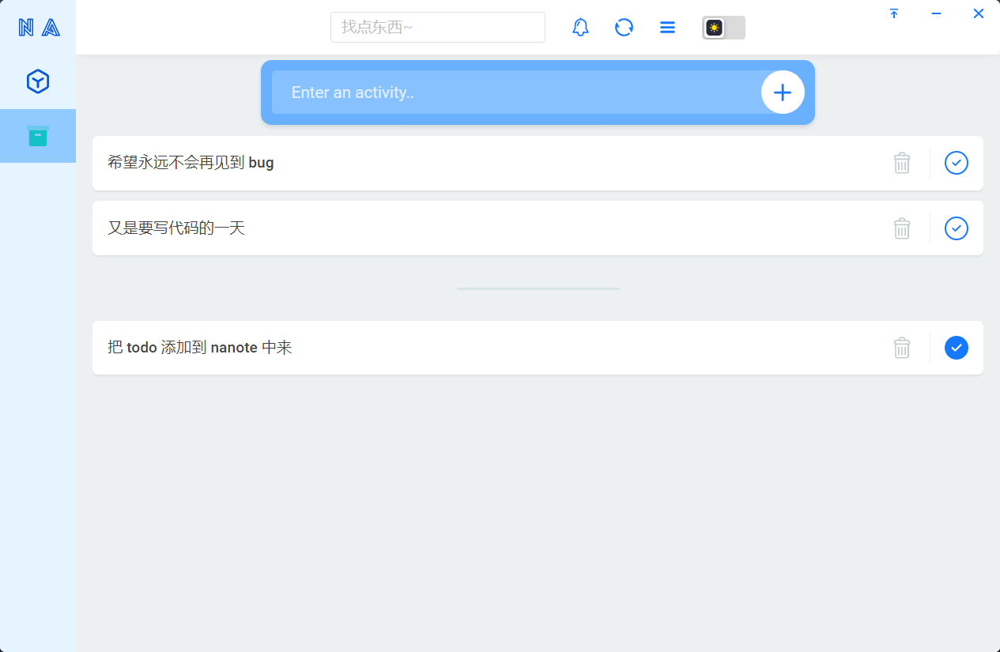

# Nanote

A plugin container that is a little brain-intensive to develop. 
Yes, it's not a plugin or a collection of plugins, it's a container.

一个开发起来有点费脑子的插件容器。是的，它不是插件或插件集合，是个容器。

> 👏 Nanote is still under development, but the structure has been finalized, 
leaving no brains to cut the picture, and it will be available in a short time.
> 
> Nanote 仍在开发中，但结构已经定型，就剩下无脑切图了，过不了多久就上线。
> [🎉 查看最新进展](./TODO.md)，也可以查看 [🎉 模型图](./docs/think.md)

## Introduction

Nanote 是一个基于 `Electron` 构建的跨平台插件容器，你可以开发适合自己的任何插件，
在 [qiankun](https://qiankun.umijs.org/) 的强大支撑下，你的技术栈不再受到限制。

### 🍭 preview

### ✨ Features

- 因为 qiankun 本身就是技术栈无关的，所以它支持 vue、react、jquery 等很多前端框架来构建你自己的插件
- 提供类似手机 📱 “负一屏” 的组件面板，组件可以被放大、缩小甚至任意移动
- 可以打开独立的插件窗口，也可以固定到桌面上，也可以固定到侧边栏
- 随意更改主题颜色，在亮暗模式之间随心切换
- 支持自定义 `NodeJS` 脚本，意味着 Nanote 更高 💪 的能力 “上限”
- 抱歉，不能剧透更多了 😅

### 📢 Note

❗ It is risky to use plugins provided by others, 
so it is best to use them after confirming that there is no "backdoor". 
I only guarantee that **Nanote** itself and its affiliated plugins are non-aggressive. 
I am deeply sorry for any loss caused by using other people's plugins, 
but I do not assume any responsibility.

使用他人提供的插件有风险，所以最好在确认没有 **“后门”** 的情况下使用。
本人仅仅保证 **Nanote** 本身及附属插件的无攻击性，因使用他人插件造成的任何损失，
我深感抱歉但不承担任何责任。

> 👉 如果你想分享插件给别人，最好开放源代码，这样可以受到监督。

一般意义上来讲，“纯前端” 的插件最安全，因为它可调用的 API 都是收到限制的，
如 Nanote 内置的 `nanote-bookmark`，`nanote-todo` 仅仅调用了存、取数据两个 API，
再加上 qiankun 的 JS 沙箱机制，安全系数是相对很高的

而比如要完成 “手机电脑文件互传” 这样的功能，必不可少地要执行 Node 脚本，
建立 `http server` 或者 `socket server`，这就给了脚本很大的发挥空间，
其行为是不可控的
