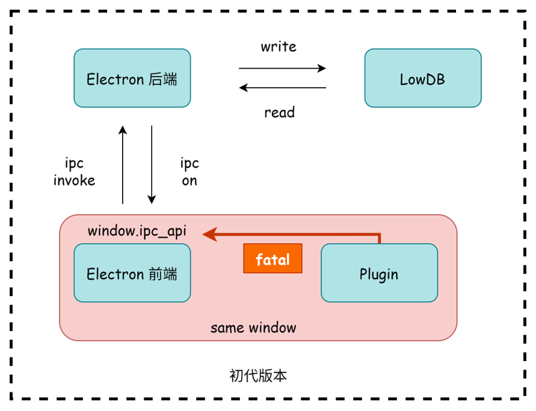
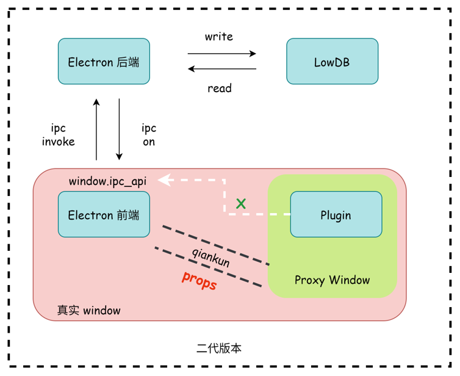
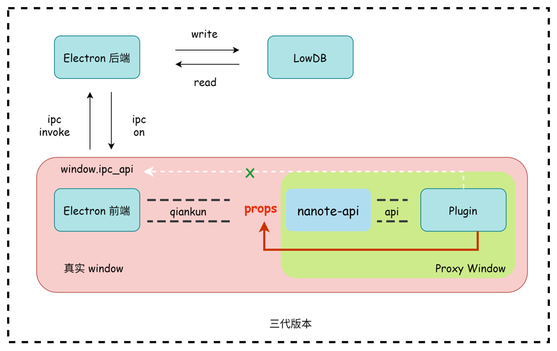
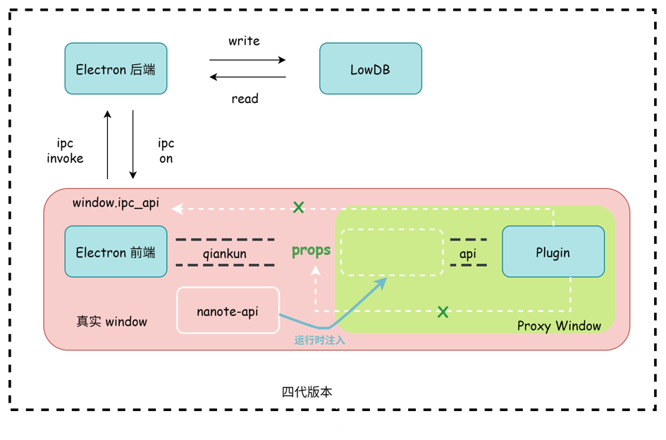

# 关于 Nanote 的思考

## 结构模型
思想斗争共进行了四个版本，它们的图示如下

### 版本 1

插件与 `Electron` 直接通信，导致 `ipc` 接口泄露

### 版本 2

接入 `qiankun` 沙盒模型，但插件可以控制 `props`，伪造 `appName`

### 版本 3 `<current>`

`nanote-api` 做中间代理掌握 `props`，但插件仍可以通过篡改源码的方式伪造 `appName`，甚至直接无视 `nanote-api`

### ⭐ 版本 4 `<future>`

`nanote-api` 在插件开发时可引入，打包时必须去除，运行时动态引入